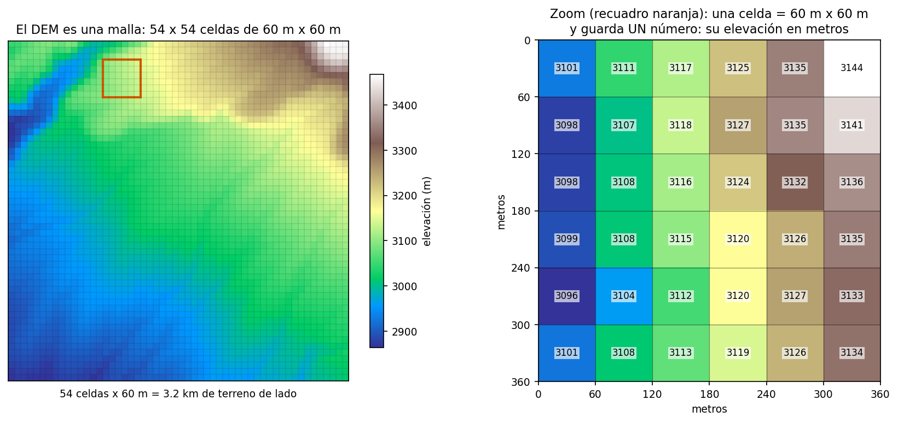
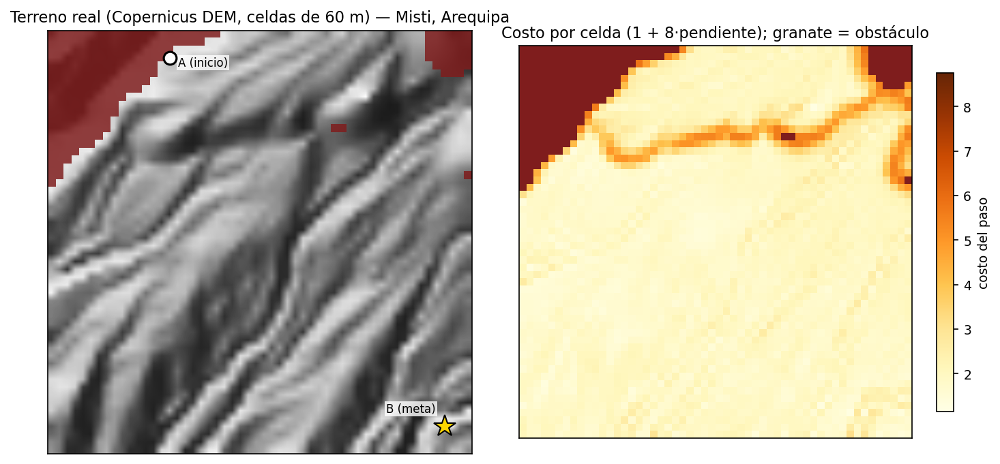
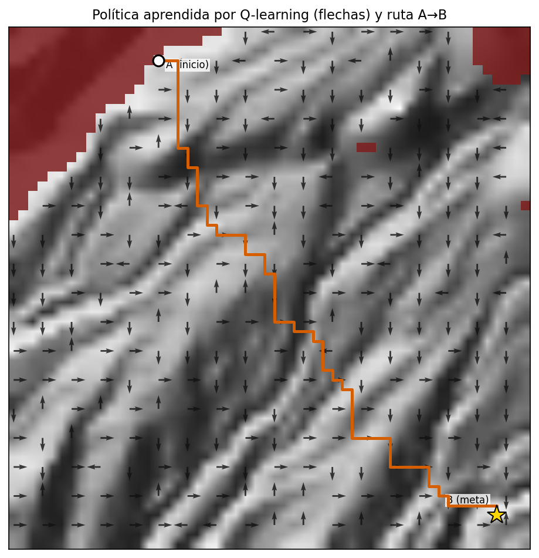
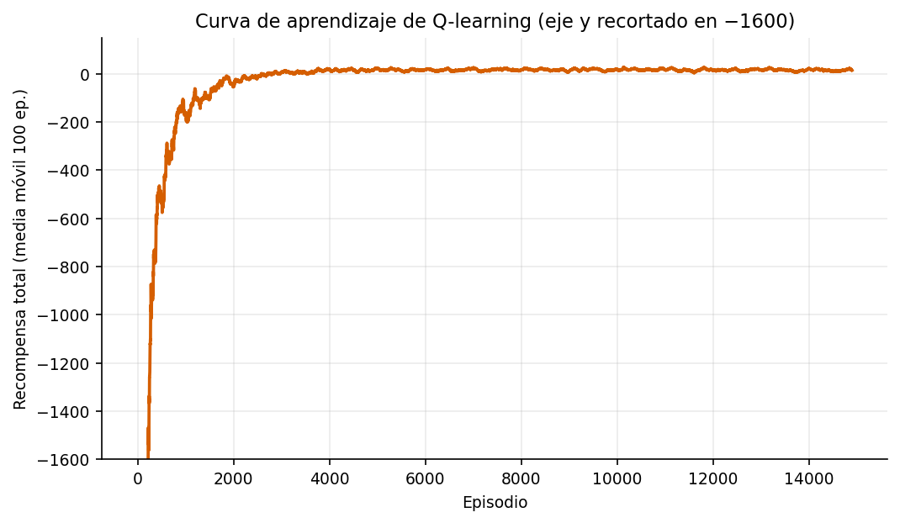

# Navegación de costo mínimo sobre terreno real usando Q-learning

**Curso:** MIA-204 · Aprendizaje por Refuerzo — Trabajo Parcial

---

## 1. Resumen

Un agente aprende, por prueba y error, a cruzar un terreno real —las faldas
del volcán Misti, Arequipa— desde un punto A hasta un punto B gastando el
menor esfuerzo posible y evitando las zonas empinadas. El terreno proviene
de un raster de elevación satelital real (Copernicus DEM GLO-30, 30 m de
resolución). Nadie le indica la ruta al agente: la descubre solo, usando
Q-learning implementado desde cero, sin ninguna librería de RL. Tras
15 000 episodios de entrenamiento (~6 s), el agente encuentra una ruta de
83 pasos y costo total 154.5 que llega a la meta bordeando las laderas
intransitables.

## 2. Planteamiento del problema

Se busca la ruta de **costo mínimo** entre dos puntos de un terreno
montañoso. Caminar por terreno plano es barato; subir laderas cuesta más; y
las zonas muy empinadas directamente no se pueden pisar. El problema es
relevante para planificación de rutas de senderismo, evacuación o acceso a
zonas rurales, y sirve como caso de estudio realista para métodos de
aprendizaje por refuerzo: el agente **no conoce el mapa** (ni los costos ni
los obstáculos) y debe aprenderlo únicamente de su experiencia.

### 2.1 Los datos: un DEM real

El terreno es un recorte de ~3×3 km de las faldas del Misti, tomado del
Copernicus DEM GLO-30 (ESA), tile S17/W072, descargado desde AWS Open Data.
Un DEM (modelo digital de elevación) es literalmente una malla de celdas
donde cada celda guarda un número: la elevación en metros de ese pedazo de
terreno.



**Figura 0.** El DEM es una malla de 54×54 celdas de 60 m × 60 m
(izquierda). Cada celda guarda un único número: su elevación en metros
sobre el nivel del mar (derecha, zoom del recuadro naranja). El DEM
original de 108×108 celdas de 30 m se promedió en bloques de 2×2 para
reducir el número de estados y acelerar el aprendizaje.

## 3. Modelamiento como MDP

El problema se formula como un Proceso de Decisión de Markov (MDP) con
cuatro ingredientes:

- **Estados (S):** cada celda de la cuadrícula 54×54, identificada por
  (fila, columna). Hay 2 686 celdas libres y 230 obstáculos.
- **Acciones (A):** moverse en cruz: arriba, abajo, izquierda, derecha.
- **Transición (P):** determinística. El agente se mueve a la celda vecina
  elegida; si esa celda es borde del mapa u obstáculo, rebota y se queda
  donde estaba.
- **Recompensa (R):**
  - paso normal: paga el costo de la celda que pisa, `−(1 + 8·pendiente)`.
    Una celda plana cuesta 1; una ladera de ~30° cuesta ~5.6;
  - chocar contra borde u obstáculo: castigo de `−50` (y no se mueve);
  - llegar a la meta: premio de `+100` y el episodio termina.

La pendiente de cada celda se calcula con `np.gradient` sobre la elevación
(metros que sube el terreno por metro avanzado, combinando las dos
direcciones con Pitágoras). Las celdas con pendiente mayor a 0.60 (~31°) se
marcan como obstáculo: nadie sube una pared.



**Figura 1.** Izquierda: el terreno real con relieve sombreado; en granate
los obstáculos (pendiente intransitable), A es el inicio y B la meta.
Derecha: el costo de pisar cada celda, `1 + 8·pendiente`. El agente nunca
ve estos mapas: solo recibe recompensas paso a paso.

Dos detalles del entorno merecen mención:

1. **Islas inalcanzables.** Puede haber celdas libres completamente
   rodeadas de obstáculos. Se detectan con una búsqueda en anchura (BFS)
   desde la meta y se enmascaran como obstáculo, de modo que desde toda
   celda libre exista siempre un camino a B.
2. **Inicio y meta.** Se colocan en esquinas opuestas del mapa (o en la
   celda libre más cercana si la esquina cae en obstáculo): A=(3, 15),
   B=(50, 50). La ruta debe cruzar todo el terreno.

## 4. Método: Q-learning desde cero

Q-learning es un método **model-free**: el agente aprende sin modelo del
mundo, solo con experiencia. Lo que aprende es una tabla Q que, para cada
celda y cada acción, estima "si estoy aquí y hago esto, ¿qué tan bien me
irá en total?". Todo el algoritmo se reduce al update de diferencia
temporal (TD):

$$Q(s,a) \leftarrow Q(s,a) + \alpha \left[ r + \gamma \max_{a'} Q(s',a') - Q(s,a) \right]$$

Se compara lo que el agente creía que valía ese movimiento contra lo que
acaba de vivir (la recompensa más lo mejor que le espera desde donde cayó);
la creencia se corrige una fracción α hacia la realidad. Como el objetivo
usa el **máximo** sobre las acciones siguientes aunque el agente después
explore otra cosa, Q-learning es **off-policy**.

Las acciones se eligen con una política **ε-greedy**: con probabilidad ε el
agente prueba una acción al azar (explorar); el resto del tiempo toma la
mejor según su tabla (explotar).

### 4.1 Hiperparámetros y decisiones de diseño

| Parámetro | Valor | Justificación |
|---|---|---|
| γ (descuento) | 1.0 | La tarea es episódica con meta absorbente: se minimiza el costo TOTAL del camino sin descontar. Con γ < 1 y rutas de ~100 pasos el premio de la meta se desvanece (100·0.99¹⁰⁰ ≈ 37) y al agente le conviene vagar por celdas baratas en vez de llegar. Mismo planteo que el *cliff walking* de Sutton & Barto. |
| α (tasa de aprendizaje) | 0.5 | El entorno es determinístico: no hay ruido que promediar, así que una tasa grande solo acelera la propagación del valor de la meta. |
| ε | 1.0 → 0.005 | Decae multiplicativamente (×0.999 por episodio): primero explora mucho, al final casi solo explota lo aprendido. |
| Episodios | 15 000 | Suficiente para que la curva de aprendizaje se aplane. |
| Semilla | 42 | Resultados reproducibles. |

Además, dos decisiones que resultaron clave:

1. **Exploring starts** (Sutton & Barto). Los episodios de entrenamiento
   nacen en celdas aleatorias del mapa; la evaluación siempre desde A. Sin
   esto, el agente tendría que cruzar ~100 celdas por pura casualidad antes
   de descubrir la meta por primera vez, y propagar ese valor hasta A
   tomaría decenas de miles de episodios.
2. **Inicialización optimista.** La tabla Q arranca en cero y cada paso da
   recompensa negativa, así que las celdas nunca visitadas "se ven bien"
   comparadas con las ya probadas. Eso empuja al agente hacia lo
   inexplorado: exploración gratis.

## 5. Resultados

El entrenamiento completo (15 000 episodios) toma ~6 segundos. La política
final, evaluada desde A sin exploración ni azar, **llega a la meta en 83
pasos con un costo total de 154.5**.



**Figura 2.** La política aprendida (flechas: la mejor acción en cada
celda, submuestreadas para legibilidad) y la ruta A→B que resulta de
seguirla desde el inicio (naranja). La ruta bordea las zonas granate
(obstáculos) y evita las laderas caras, en lugar de ir en línea recta.



**Figura 3.** Recompensa total por episodio (media móvil de 100
episodios). Los primeros episodios son muy malos (recompensas de ~−7000:
puro chocar y vagar; el eje y está recortado en −1600 para que la mejora no
quede aplastada contra el cero). La curva sube de forma sostenida y se
aplana cerca de cero: el agente aprendió y su comportamiento convergió.

Lectura de los resultados:

- La curva de aprendizaje confirma la mecánica esperada de Q-learning: la
  mejora es gradual (el valor de la meta se propaga celda a celda hacia
  atrás) y la meseta final coincide con ε cerca de su mínimo.
- La ruta aprendida no es la línea recta entre A y B: rodea las laderas
  empinadas, que es exactamente el comportamiento que la función de
  recompensa buscaba inducir. El agente lo descubrió sin conocer el mapa.

## 6. Conclusiones

- Se modeló un problema de navegación sobre terreno **real** como un MDP
  tabular y se resolvió con Q-learning implementado desde cero (~50 líneas
  de lógica), sin librerías de RL.
- El agente, sin conocer costos ni obstáculos, aprendió una política que
  llega a la meta con una ruta de bajo costo que evita las pendientes.
- Las decisiones de diseño importaron tanto como el algoritmo: γ = 1 (costo
  total sin descontar), exploring starts y la inicialización optimista
  fueron necesarias para que el aprendizaje fuera viable en un mapa de
  ~2 700 estados con recompensa escasa.

## 7. Trabajo futuro (trabajo final)

- Comparar contra **SARSA** (on-policy) y contra la solución exacta por
  **Value Iteration**.
- Barrido de hiperparámetros: efecto de α, γ y ε.
- Obstáculos reales de **OpenStreetMap** (agua, edificios) con `osmnx`.
- Transición **estocástica** (probabilidad de "resbalar") para evaluar la
  robustez de la política.

## 8. Reproducibilidad

```bash
pip install -r requirements.txt
python main.py     # entrena y genera las 4 figuras en results/ (~10 s)
```

`data/dem.tif` está incluido en el repositorio; `download_dem.py` permite
re-descargar el recorte desde AWS Open Data. La semilla está fija, así que
toda corrida reproduce exactamente las figuras y números de este informe.

## Referencias

- Sutton, R. S. & Barto, A. G. (2018). *Reinforcement Learning: An
  Introduction* (2.ª ed.). MIT Press.
- ESA. Copernicus DEM GLO-30. Tile S17/W072, vía AWS Open Data
  (`s3://copernicus-dem-30m/`).
